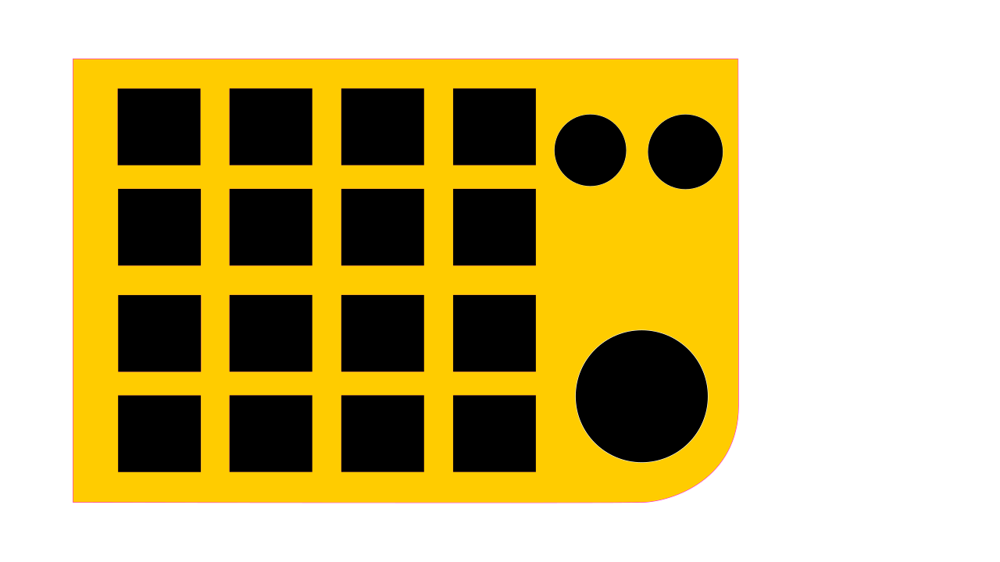

# DOIO Layout Viewer

DOIO KB16 マクロパッド用のキーボードレイアウト可視化ツール


## 概要

このアプリケーションは、DOIO KB16 マクロパッドのキーボードレイアウトをリアルタイムで表示・編集できるGUIツールです。

## 開発の経緯

Kivyを使ったプログラムの練習目的かつ、コードのほとんどが生成AIです。
DOIO KB16を買って使ってみたものの、キーマップを変えたら変えたで、どこに何を配置したかわからなくなりました。それを解消するための簡単なコードを書いてみました（ほぼほぼ書かせてみました）。
そんな経緯なので、**このプロジェクトはパブリックドメイン（著作権放棄）です。**お好きに使ってください。

### 主な機能

- 📍 **ビジュアルレイアウト表示**: 実際のキーボード画像上にキーコードを表示
- 🎨 **多層サポート**: 4つのレイヤー（Fn層）に対応
- 🔄 **エンコーダー表示**: 回転エンコーダーの機能を視覚的に表示
- 📂 **ドラッグ&ドロップ**: JSONファイルをドラッグして新しいレイアウトを読み込み
- 🌐 **日本語対応**: キーコードを日本語で表示
- 📤 **実行ファイル対応**: PyInstallerでスタンドアロン実行ファイル化可能

## スクリーンショット



## インストール

### 開発環境

```bash
# リポジトリをクローン
git clone https://github.com/garcy72/DOIO-KB16-Layout-Viewer.git
cd DOIO-Layout-Viewer

# 仮想環境を作成
python -m venv .venv
.venv\Scripts\activate

# 依存パッケージをインストール
pip install -r requirements.txt

# アプリケーションを起動
python main.pyw
```

## 使い方

初期のレイアウトは私が適当に作ったものです。工場出荷に戻したかったのですが、すでに最初の設定がわからなくなってますので戻せません。ご了承願います。

### レイアウト表示

1. アプリを起動
2. 左パネルのラジオボタンでレイヤー（1-4）を選択
3. キーボード画像上に各キーのコード（日本語訳）が表示されます

### レイアウト変更

1. JSON形式のキーボードレイアウトファイルを用意

    > [VIA](https://www.usevia.app) へ行き、設定ファイルをSAVEしたものを使うのが確実です。

2. ファイルをアプリ画面にドラッグ&ドロップ
3. 新しいレイアウトが自動的に読み込まれます

### JSONフォーマット

```json
{
  "name": "KB16-01",
  "vendorProductId": 3490715137,
  "layers": [
    [
      "KC_F13", "KC_F14", ...
    ]
  ],
  "encoders": [
    [
      ["KC_LEFT", "KC_RGHT"],
      ...
    ]
  ]
}
```

## ビルド方法

実行ファイルを生成する場合：

```bash
# 依存パッケージをインストール
pip install -r requirements.txt
pip install pyinstaller kivy-deps.sdl2 kivy-deps.glew

# ビルド実行
python build_exe.py
```

詳細は [BUILD_README.md](BUILD_README.md) を参照してください。

## ファイル構成

```
DOIO-Layout-Viewer/
├── main.pyw                      # メインアプリケーション
├── my.kv                         # Kivy UIレイアウト定義
├── layout.json                   # デフォルトキーボードレイアウト
├── DOIO.png                      # キーボード背景画像
├── build_exe.py                  # 実行ファイルビルドスクリプト
├── DOIO_Layout_Viewer.spec       # PyInstallerスペック
├── requirements.txt              # Python依存パッケージ
├── LICENSE.md                    # ライセンス情報
├── BUILD_README.md               # ビルド手順
└── README.md                     # このファイル
```

## 技術スタック

- **GUI Framework**: [Kivy](https://kivy.org/) 2.3+
- **画像処理**: [Pillow](https://python-pillow.org/)
- **日本語フォント**: [japanize_kivy](https://github.com/yurokle/japanize_kivy)
- **実行ファイル化**: [PyInstaller](https://www.pyinstaller.org/)

## ライセンス

**このプロジェクトはパブリックドメイン（著作権放棄）です。**

著作権の制限はありません。自由に：

- 使用
- 改変
- 配布
- 商用利用
- 再配布

ライセンス表記も不要です。好きなように使ってください！

詳細は [LICENSE.md](LICENSE.md) を参照してください。

## 対応キーボード

- DOIO KB16-01

## トラブルシューティング

### 日本語が文字化けする

- `japanize_kivy` が正しくインストールされているか確認
- `requirements.txt` のパッケージを再インストール

### JSONファイルが読み込めない

- ファイルはUTF-8エンコーディングで保存
- JSON形式が正しいか確認（JSONバリデータで検証）
- `layout.json` の構造を参考に

### 画像が表示されない

- `DOIO.png` が正しい場所にあるか確認
- 実行ファイル版の場合、フォルダ構成を確認

## 貢献

バグ報告や機能提案は [Issues](../../issues) でお願いします。
特に権利主張はしないので、報告なしで勝手に直して使っても構いません。

## 参考リンク

- [VIA|VIA](https://caniusevia.com)
- [VIA](https://www.usevia.app)
- [QMK Firmware](https://qmk.fm/)
- [VIAL](https://get.vial.today/)

---

**最終更新**: 2025年12月17日
